> Created by: [Stephen Lebed](https://github.com/slebed)

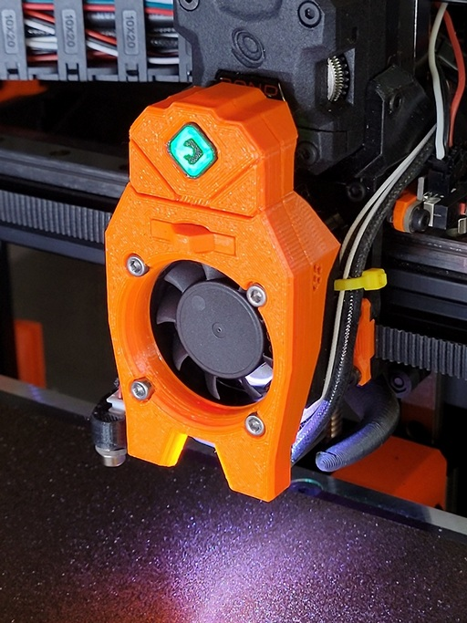

## Description
This is custom EVA shroud inspired by the Voron Stealthburner and Paweł Kucmus's EVA Queen shroud and carriage platform. This shroud should be a drop-in replacement for any EVA 2.4 shroud. Features of this shroud include a hidden ADXL345 mount, dual Neopixel RGB LEDs for seeing what you're printing and a Neopixel RGB LED backlit EVA logo.

Because of all the wires this shroud requires, I've designed channels for the wires to fit into which will hide them from view.  The channel should have enough room for three 24awg wires, although I recommend using 28awg wires due to their flexibility.

The dual Neopixel LEDs at the bottom are mounted at an angle away and downward to better illuminate the part being printed.  This also keeps the LEDs from shining in your face.  

There is a back cover that will snap into place to seal the wires in.  There is a small opening for the wires to go out to a connector.  

#### Disclaimer
The names Voron, Stealthburner, EVA and Queen shroud are owned by their respective parties.  This design is under the same license as EVA 2.4 which is [CC BY-SA 4.0 license](https://creativecommons.org/licenses/by-sa/4.0/).

> **Warning:** This is a BETA release!  The stl files are getting updated often.  Please refer to the changelog.  These instructions are not complete!

If you want to contact me I'm **slebed#1717** on the [Unofficial Rat Rig Discord Server](https://discord.gg/D62e8XNeYa)

#### Attributions
This wouldn't have been possible without the amazing work done by Paweł Kucmus and his [EVA Carriage Standard](https://main.eva-3d.page/).  Please consider donating to his [Paypal.me](https://www.paypal.me/pkucmus).


## BOM

| No | Qty | Name                                           | Printable | Notes|
| -- | --- | ---------------------------------------------- | --------- |----------------------|
| 1  | 1   | King Shroud body                               | [Yes](stl/KingsShroud_v179_body.stl) |Print in primary color|
| 2  | 1   | King Shroud back cover                         | [Yes](stl/KingsShroud_v179_back.stl)|Print in primary color|
| 3  | 1   | EVA Logo LED holder                            |  [Yes](stl/KingsShroud_v174-LogoLEDHolderLogoLEDHolderLEDHolder.stl)|Print in translucent or natural filament|
| 4  | 1   | EVA Logo LED clip                              |  [Yes](stl/KingsShroud_v174-LogoLEDHolderLogoLEDHolderLEDclip.stl)|Print in any color|
| 5  | 1   | EVA Logo sheath                                |  [Yes](stl/KingsShroud_v166-LogoLEDHolderLogoLEDHolderSheath.stl)|Print in black filament|
| 6  | 1   | EVA Logo insert                                |  [Yes](stl/KingsShroud_v167-LogoLEDHolderLogoLEDHolderInsert.stl)|Print in black filament|
| 7  | 1   | King Shroud ADXL port cover                    | [Yes](stl/KingsShroud_ADXL_cover_v04.STL)|
| 8  | 1   | ADXL345                                        | No  |I used this one from [Amazon.com](https://www.amazon.com/dp/B08HLP1MPY/ref=cm_sw_em_r_mt_dp_ZATE89GFDS2K0VEVVJN0?_encoding=UTF8&psc=1)|
| 9  | 3   |Neopixel LED (ws2812)|No|I used these from [Amazon.com](https://www.amazon.com/dp/B00P2GQUYC/ref=cm_sw_em_r_mt_dp_PMNZGTJADRJEV3NSN1C2?_encoding=UTF8&psc=1) but any compatible ones should work.|
| 10  | 3   | 28awg stranded wire                                   |No   |I used this from [Amazon.ca](https://www.amazon.ca/dp/B07THYKBBK/ref=cm_sw_em_r_mt_dp_ZGJWJ1PHSKGGRQ51FVXV?_encoding=UTF8&psc=1)  |
| 11 | 4   | M3 x20mm Caphead screw                    	    | No  ||
| 12 | 2   | M3 x8mm Caphead screw                        	| No  |Used for attaching ADXL to body


## Compatible EVA version

2.4 and newer.

## Print preparation

Print the KingsShroud_v176.stl face down on the bed in your primary color.  Note that these parts were designed to be printed with PETG and are a tight fit.  If printing in ABS, please adjust for shrinkage.

I used SuperSlicer to print my parts using the following settings
 - 0.4 nozzle
 - 4 perimeters
 - 5 top and bottom layers
 - No supports are necessary
 - Bottom infill set to Archimedean Chords

 Wait!? What's that infill all about?  And what's going on with this...

 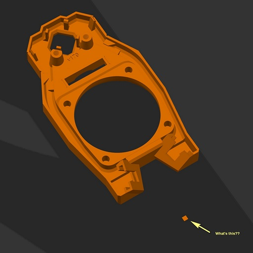

Well its a small detail, but if print the body by itself and you set infill to this...

  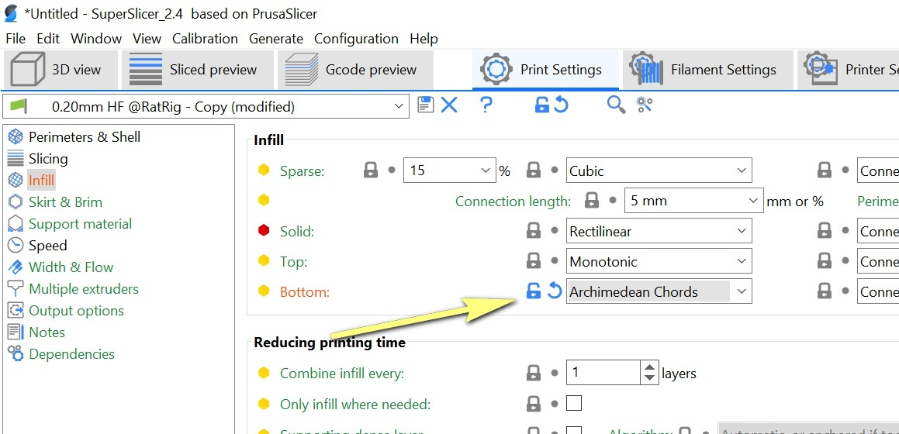

Then the slicer will create this...

 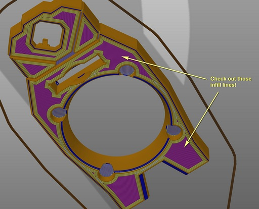

 All the infill will radiate outward from the fan opening.

 Granted, its a detail that probably won't show if you print on a textured sheet or have a lot of squish, but its there.

> **Note:** The are four 'Pokey Poke' holes that will need to be drilled out prior to assembly.

Here is a image showing how the parts should be oriented in your slicer.

 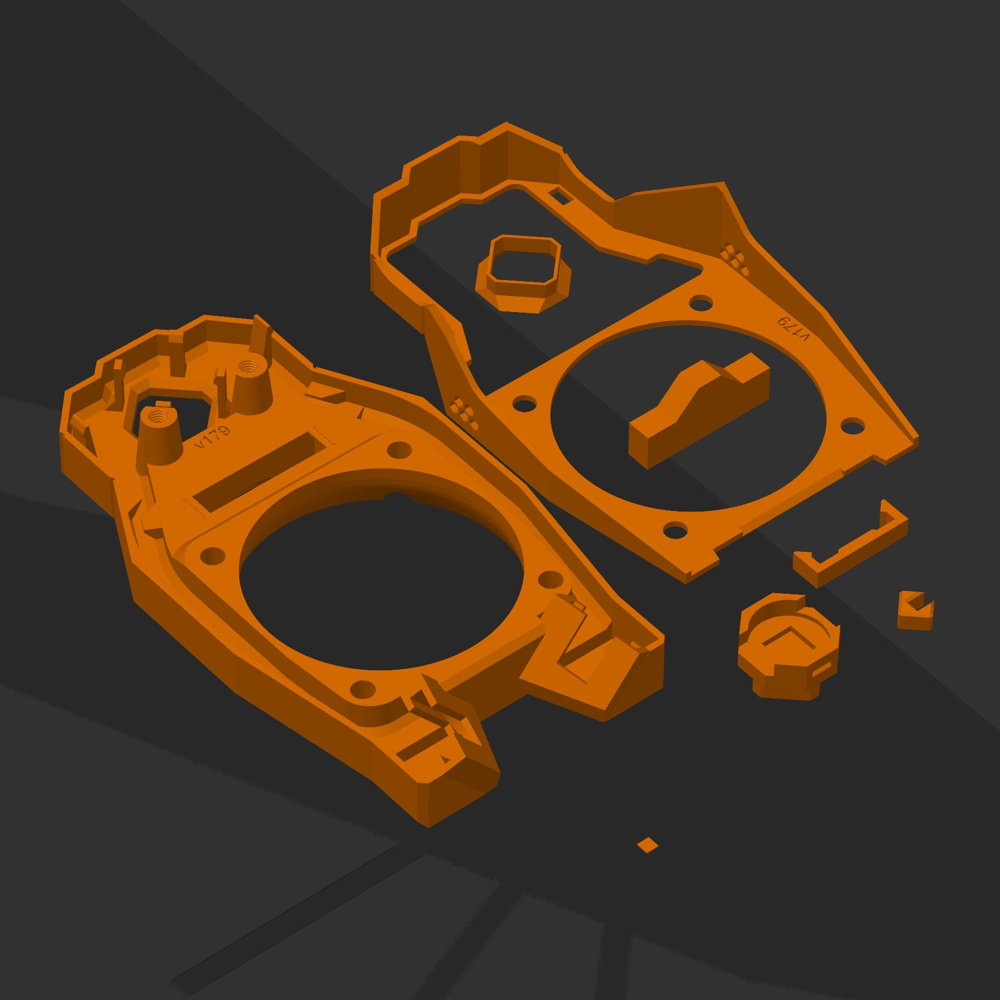

## Assembly instructions

#### Assembling the Logo LED Holder

Here are the printed parts for the Logo LED Holder.

  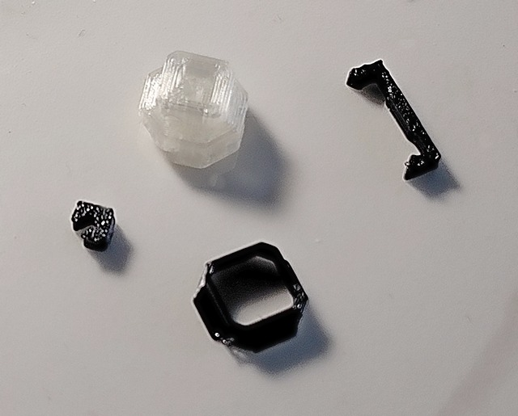

 - Press the EVA logo insert into the EVA Logo LED holder as shown in yellow below.

 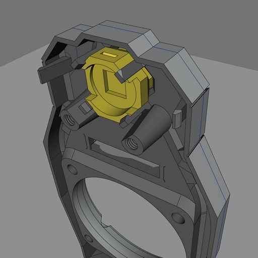

 - Press the EVA logo sheath onto the EVA logo LED holder as shown in yellow below.

    

    Example of the assembled LogoLEDHolder

     

 - Press the EVA logo LED holder into the back of the King Shroud body as shown in yellow below.  The part should press fit into the opening in the body.

 > **Note:** Make sure the logo holder is oriented like the image below.  From the front the logo should be oriented like the photo above.

    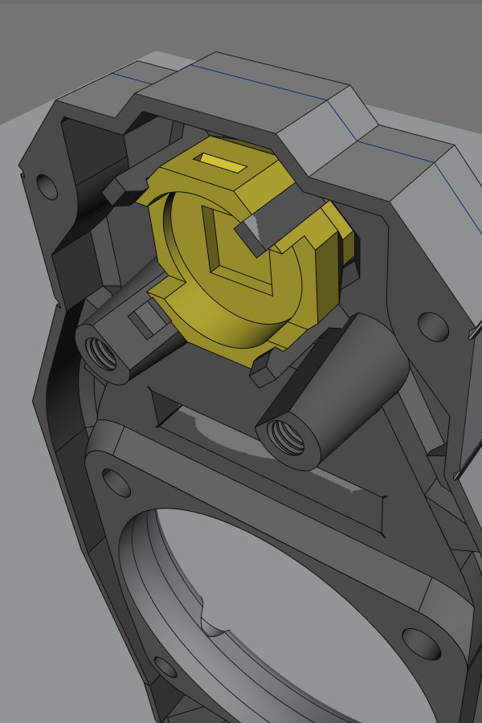

#### Wiring the Neopixel (ws2812) LED harness

 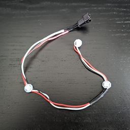

I used 28awg stranded wire cut to the following lengths: 3x 100mm long, 3x 60mm long, and 3x as long as you need to go from the first LED in line to a connector outside the King Shroud, at least 60mm.

- Solder the wires from the outside three pin connector to the 'IN' pins on the first LED.
- Solder the three 100mm wires from the 'OUT' of the first LED to the 'IN' of the second LED.
- Solder the three 60mm wires from the 'OUT' of the second LED so they all are laying over the three wires going 'IN'.
- Solder the other ends of the three 60mm wires to the 'IN' of the last LED.  


#### Inserting the LEDs into the King shroud

 - Starting with the last LED, insert it into the bottom right side of the King Shroud with the wires pointing out.  Slide the LED disk into the channel making sure the square housing of the LED should fits nicely into the slot.  The square LED housing should slide all the way into the channel.  A small nub will keep the LED from falling out.

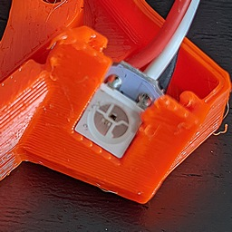

- Insert the next LED into the left side bottom.  Make sure the LED is oriented so that all the wires are sticking out from the body.  Carefully press the LED completely into the holder for it.

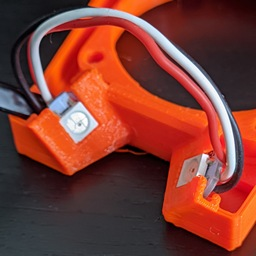

- Using a small flathead screwdriver or Allen wrench, careful push the wires into the channels as shown below.

 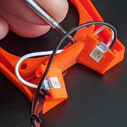
 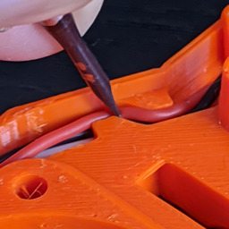

- Place the remaining LED into the Logo LED Holder.  Its wires should lay across in the small slot.

 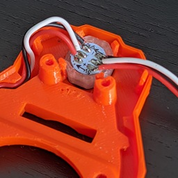

-  Press the clip over the LED so that it clicks into place.  Here is a photo showing the wiring and clip in place.

 
 

#### Wiring the adxl345

 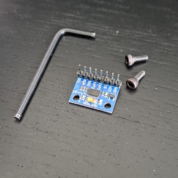

Your ADXL345 will need to have its connector pin soldered in place.  Insert the pin on the side with the components and solder them in place from behind.  Attach the ADXL345 using the two 8mm M3 screws.  Carefully screw them into the threaded holes until they are tight.

Here is an example of the accelerometer mounted in place.

 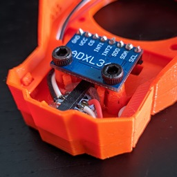

#### Attaching the back wire cover

Take the wires that go to the connector and pass them through the opening in the back cover.


 > **Note:** The ADXL345 board has been removed for clarity but can be left in place for this next step.

 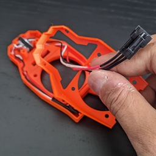

Take the back cover and carefully lay it on the body.  There is a small grooved slot at the bottom that goes behind a tab above the bottom LED holders.  

 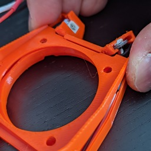

Align the two upper tabs with the matching holes in the back and snap them into place.  They are circled in the photo below.

  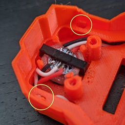

Take the four M3 x 20mm screws and pass them through the front of the body.  Attach the toolhead fan to the four screws.  Place the entire assembly to your EVA carriage and attach it like you would any other shroud.

**Photo below is the completed assembly on a Rat Rig V-Core3 with a Bondtech LGX and Mosquito Magnum, and Euclid probe.**

  

## Klipper Macros

  My LEDs are driven by a BTT Octopus 1.1 board and I'm using the RGBLED port.  If you are using a different board or a different port, then make sure you change 'pin:' to whatever pin you're using.

  I'm controlling the LEDs with these simple macros in Klipper.  They can be copy/pasted into your printer.cfg below the Macros section.

  ```
[neopixel board_rgb]
  pin: PB0
  chain_count: 3
  color_order: GRB
  initial_RED: 0
  initial_GREEN: 0
  initial_BLUE: 0

[gcode_macro TOOLHEAD_LOGOBLUE]
gcode:
  SET_LED LED=board_rgb RED=0 GREEN=0 BLUE=.2 INDEX=1 TRANSMIT=1

[gcode_macro TOOLHEAD_LOGORED]
gcode:
  SET_LED LED=board_rgb RED=0.1 GREEN=0 BLUE=0 INDEX=1 TRANSMIT=1

[gcode_macro TOOLHEAD_LOGOGREEN]
gcode:
  SET_LED LED=board_rgb RED=0 GREEN=0.1 BLUE=0 INDEX=1 TRANSMIT=1

[gcode_macro TOOLHEAD_LOGOWHITE]
gcode:
  SET_LED LED=board_rgb RED=1.0 GREEN=1.0 BLUE=1.0 INDEX=1 TRANSMIT=1

[gcode_macro TOOLHEAD_WORKLIGHT_FULL]
gcode:
  SET_LED LED=board_rgb RED=1.0 GREEN=1.0 BLUE=1.0 INDEX=2 TRANSMIT=0
  SET_LED LED=board_rgb RED=1.0 GREEN=1.0 BLUE=1.0 INDEX=3 TRANSMIT=1

[gcode_macro TOOLHEAD_WORKLIGHT_MED]
gcode:
  SET_LED LED=board_rgb RED=0.5 GREEN=0.5 BLUE=0.5 INDEX=2 TRANSMIT=0
  SET_LED LED=board_rgb RED=0.5 GREEN=0.5 BLUE=0.5 INDEX=3 TRANSMIT=1

[gcode_macro TOOLHEAD_WORKLIGHT_LOW]
gcode:
  SET_LED LED=board_rgb RED=0.25 GREEN=0.25 BLUE=0.25 INDEX=2 TRANSMIT=0
  SET_LED LED=board_rgb RED=0.25 GREEN=0.25 BLUE=0.25 INDEX=3 TRANSMIT=1
```
