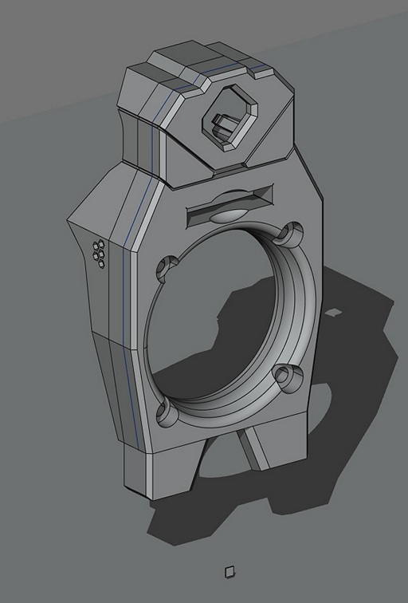
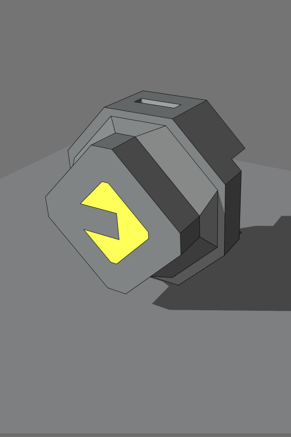
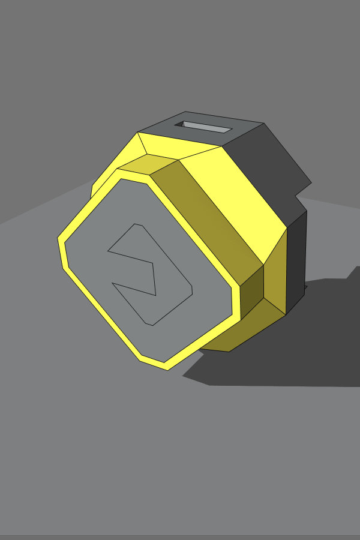

> Created by: [Stephen Lebed](https://github.com/slebed)

## Description
This is my Voron Stealthburner inspired shroud with hidden ADXL345 mount, dual Neopixel RGBLEDs for seeing what you're printing and a Neopixel RGBLED EVA logo.

## BOM
| No | Qty | Name                                           | Printable | Notes
| -- | --- | ---------------------------------------------- | --------- |----------------------
| 1  | 1   | King Shroud body                                | [Yes](stl/KingsShroud_v176_body.stl) |Print in primary color
| 2  | 1   | King Shroud back cover                         | [Yes](stl/KingShroud_v176_back.stl)|Print in primary color
| 3  | 1   | EVA Logo LED holder                            |  [Yes](stl/KingsShroud_v174-LogoLEDHolderLogoLEDHolderLEDHolder.stl)|Print in translucent or natural filament
| 4  | 1   | EVA Logo LED clip                           |  [Yes](stl/KingsShroud_v174-LogoLEDHolderLogoLEDHolderLEDclip.stl)|Print in any color
| 5  | 1   | EVA Logo sheath                            |  [Yes](stl/KingsShroud_v166-LogoLEDHolderLogoLEDHolderSheath.stl)|Print in black filament
| 6  | 1   | EVA Logo insert                            |  [Yes](stl/KingsShroud_v167-LogoLEDHolderLogoLEDHolderInsert.stl)|Print in black filament
| 7  | 1   | ADXL345                                        | No        |I used this one from [Amazon.com](https://www.amazon.com/dp/B08HLP1MPY/ref=cm_sw_em_r_mt_dp_ZATE89GFDS2K0VEVVJN0?_encoding=UTF8&psc=1)
|8|3|Neopixel LED (ws2812)|No|I used these from [Amazon.com](https://www.amazon.com/dp/B00P2GQUYC/ref=cm_sw_em_r_mt_dp_PMNZGTJADRJEV3NSN1C2?_encoding=UTF8&psc=1) but any compatible ones should work.
|9|3| 28awg stranded wire                                      |No     |I used this from [Amazon.ca](https://www.amazon.ca/dp/B07THYKBBK/ref=cm_sw_em_r_mt_dp_ZGJWJ1PHSKGGRQ51FVXV?_encoding=UTF8&psc=1)  
|10  | 4   | M3 x20mm Caphead screw                    		    | No        |
| 11  | 2   | M3 x8mm Caphead screw                          	  	| No        |Used for attaching ADXL to body

## Compatible EVA version

2.4 and newer.

## Print preparation

Print the KingsShroud_v176.stl face down on the bed in your primary color.  Note that these parts were designed to be printed with Petg and are a tight fit.  If printing in ABS, please allow for shrinkable.  Use 4 perimeters, 5 top and bottom layers.

> **Note:** The are four sacrificial holes that will need to be drilled out prior to assembly.

## Assembly instructions

 - Press the EVA logo insert into the EVA Logo LED holder as shown in yellow below.

    

 - Press the EVA logo sheath onto the EVA logo LED holder as shown in yellow below.

    

- Press the EVA logo LED holder into the back of the King Shroud body as shown in yellow below.  The part should press fit into the opening in the body.

    

#### Wiring the Neopixel (ws2812) LED harness

I used 28awg stranded wire cut to the following lengths: 3x 100mm long, 3x 60mm long, and 3x as long as you need to go from the first LED in line to a connector outside the King Shroud, at least 60mm.

- Solder the wires from the outside three pin connector to the 'IN' pins on the first LED.
- Solder the three 100mm wires from the 'OUT' of the first LED to the 'IN' of the second LED.
- Solder the three 60mm wires from the 'OUT' of the second LED so they all are laying over the three wires going 'IN'.
- Solder the other ends of the three 60mm wires to the 'IN' of the last LED.  

#### Inserting the LEDs into the King shroud

 - Starting with the last LED, insert it into the bottom right side of the King Shroud with the wires pointing out.  Slide the LED disk into the channel making sure the square housing of the LED should fits nicely into the slot.  The square LED housing should slide all the way into the channel.  A small nub will keep the LED from falling out.
 - Insert the next LED into the left side bottom.   

#### Wiring the adxl345_shroud

Your ADXL345 will need to have its connector pin soldered in place.  Insert the pin on the side with the components and solder them in place from behind.

## Step Files
??
